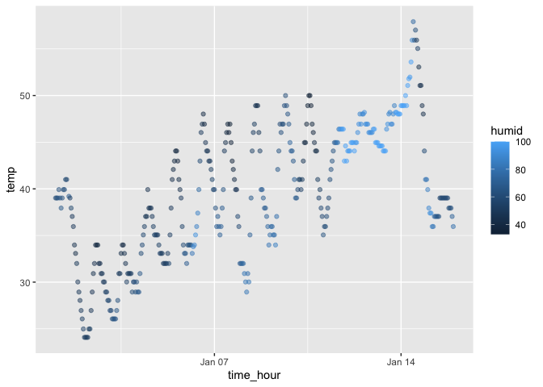

P8105 Homework 1
================
Su Yan
2025-09-20

## Problem 1

Load the data set.

``` r
library(moderndive)
data("early_january_weather")
```

The dataset is made of weather data for LGA, JFK, and EWR in early
January 2013. It includes data of 15 variables, which are: origin, year,
month, day, hour, temp, dewp, humid, wind_dir, wind_speed, wind_gust,
precip, pressure, visib, time_hour.  
The dataset contains 358 rows and 15 columns of data.  
The temperature on average during this period of time is 39.5821229

``` r
library(ggplot2)
ggplot(early_january_weather, 
       aes(x = time_hour, y = temp, color = humid)) + 
  geom_point(alpha = .5)
```

<!-- --> From the
scatterplot, we can see that in general, the weather become warmer as
days go by in early January. There is a clear cycle that each day the
temperature rise up in the day time and goes down in the night time, and
is repeated each day. Humidity tends to be lower when temperatures are
high (around midday). However, between Jan 11th to Jan 14th, the
temperature remain relatively stable through out day and night and has a
constant high humidity.

``` r
ggsave("temp_vs_time.png")
```

    ## Saving 7 x 5 in image

## Problem 2

Create a random sample and vectors.

``` r
x = rnorm(10)
prob2_df = tibble(
  x = x, 
  vec_logical = x > 0,
  vec_char = c("This", "is","hw","1","Problem","2","for","P8105","DS","course"),
  vec_factor = factor(rep(c("A", "B", "C"), length.out = 10)))
print(prob2_df)
```

    ## # A tibble: 10 × 4
    ##         x vec_logical vec_char vec_factor
    ##     <dbl> <lgl>       <chr>    <fct>     
    ##  1 -1.18  FALSE       This     A         
    ##  2 -0.157 FALSE       is       B         
    ##  3  0.442 TRUE        hw       C         
    ##  4  3.65  TRUE        1        A         
    ##  5  0.152 TRUE        Problem  B         
    ##  6 -0.817 FALSE       2        C         
    ##  7  0.314 TRUE        for      A         
    ##  8 -1.36  FALSE       P8105    B         
    ##  9 -0.650 FALSE       DS       C         
    ## 10  0.513 TRUE        course   A

Try to take the mean of each variable.

``` r
mean(prob2_df |> pull(vec_logical))
```

    ## [1] 0.5

``` r
mean(prob2_df |> pull(vec_char))
```

    ## Warning in mean.default(pull(prob2_df, vec_char)): argument is not numeric or
    ## logical: returning NA

    ## [1] NA

``` r
mean(prob2_df |> pull(vec_factor))
```

    ## Warning in mean.default(pull(prob2_df, vec_factor)): argument is not numeric or
    ## logical: returning NA

    ## [1] NA

By trying to take the mean of each variable, “vec_logical” worked, the
other two didn’t.

Apply **as.numeric** function.

``` r
num_logical = prob2_df |> pull(vec_logical) |> as.numeric()
num_char = prob2_df |> pull(vec_char) |> as.numeric()
```

    ## Warning: NAs introduced by coercion

``` r
num_factor = prob2_df |> pull(vec_factor) |> as.numeric()
```

``` r
mean(num_logical)
```

    ## [1] 0.5

``` r
mean(num_char)
```

    ## [1] NA

``` r
mean(num_factor)
```

    ## [1] 1.9

Now I can calculate the means for all three because the “uncalculatable”
nominal variables are now converted to numbers by the **as.numeric()**
function. The logical variable works as TRUE and FALSE were converted to
“1” and “0”. Although the character variable is coerced to numeric, we
still get a **NA** as its mean cannot be actually calculated. Factor
variables are now converted to integer codes so a mean can be
calculated. This explained why I failed the first time. Nominal
variables like charater and factor variables cannot be directly averaged
by R unless they were converted to numeric.
